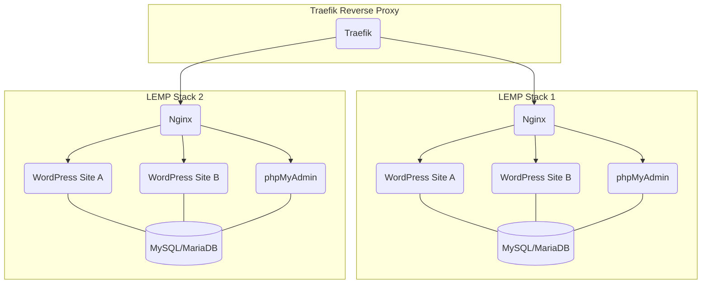
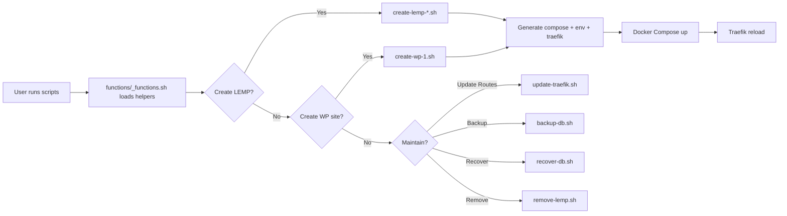

# Multi-Stack LEMP Setup (Docker-Based + Shell Automation)

This project runs **multiple independent LEMP stacks** in **Docker**, each in its own isolated environment with unique domains, services, and configurations. All lifecycle tasks (create, update, list, remove, backup, restore) are automated via **POSIX-compliant shell scripts**.

---

## How the Multistack Setup Works

### Traefik Container

- Runs traefik to route browsers to each LEMP Stack virtual host domain and subdomains in traefik/dynamic.
- Building LEMP Stacks creates a new virtual host config file in traefik/dynamic. (ie https://<LEMP_DOMAIN>, https://phpmyadmin.<LEMP_DOMAIN>)
- Building Wordpress Containers creates a new virtual host subdomain for parent LEMP's domain config file in traefik/dynamic. (ie https://<WORDPRESS_SUBDOMAIN>.<LEMP_DOMAIN>)


### LEMP Compose Stack(s)

- Creates new virutal host domains, Nginx, MySQL, PHP, and phpMyAdmin
- Unique PHP root directory and independant PHP version for files hosted from the $STACK_NAME/ directory.
- LEMP's MySQL container contains all databases unique to the LEMP stack and databases created for Wordpress containers under this LEMP STACK.
- LEMP's PHP container version DOES NOT affect LEMP STACK phpMyAdmin NOR WordPress container's PHP version.
- LEMP STACK phpMyAdmin routed under LEMP STACK's main domain, (ie https://phpmyadmin.<LEMP_DOMAIN>)
- LEMP STACK phpMyAdmin container runs its on PHP version inside its own container.
- LEMP STACK phpMyAdmin container connects to the LEMP's MYSQL container hosting databases unique to the LEMP stack.

### LEMP Compose Stack(s) -> WordPress Container(s)

- Creates a new subdomain under LEMP STACK's main domain, and unique traefik config file for this subdomain
- Connects to the LEMP Stack docker network LEMP STACK MYSQL container to create database during set up of this WordPress container.
- Wordpress images contain its own PHP version. (ie wordpress:latest = PHP likely > 8.x.x)
- DOES NOT use the LEMP STACK PHP container.
- Runs independently.

---

## Architecture Overview

Each **LEMP stack** runs in Docker and includes:
- **Nginx** (unique server domain and configuration)
- **MySQL or MariaDB** database
- **phpMyAdmin** (own subdomain)
- **SSL certificates** for all domains (local for `.test`, Let's Encrypt for production)

Each **WordPress container** runs in Docker and is connected to a specific LEMP stack:
- Has its own **domain** and **SSL certificates**
- Shares the **parent LEMP stack's database**
- Can have its own **phpMyAdmin subdomain** for DB management

---

## Goals

- **Isolated Docker networks** per LEMP stack to prevent conflicts
- **Separate scripts** for LEMP creation and WordPress container creation
- **Automated Traefik configuration**:
  - Detects new stacks/containers
  - Registers domains automatically
- **SSL Management**:
  - Local certs for `.test` domains
  - Let's Encrypt for production
- Easy scripts to **list, remove, or update** stacks
- Automated **database backups** with per-site dump folders

---

## Key Features

- Fully modular — add or remove LEMP stacks without impacting others
- Centralized **Traefik reverse proxy** for routing and SSL management
- Organized, automated backup strategy (daily + monthly retention)
- Scalable to host multiple WordPress sites per LEMP stack
- Compatible with **Docker Compose** for orchestration

---

## System Diagram



---

## Shell Automation (POSIX sh)

All automation is implemented in **portable POSIX shell** (no Bash-only features) and organized into reusable functions.

### Directory Layout (example)

```
docker-multistack-lemp
├── _environment.sh
├── functions
├── scripts
├── stacks
│   ├── lemp_domain_one
│   │   └── containers
│   │       ├── suddomain-one
│	│	 	│	├── docker-compose.yml
│	│	 	│	├── Dockerfile
│   │       │   └─── html
│   │       └── subdomain-two
│	│	 		├── docker-compose.yml
│	│	 		├── Dockerfile
│   │           └── html
│   └── lemp_domain_two
│    	   	└─── containers
│       	    ├── subdomain-three
│			 	│	├── docker-compose.yml
│			 	│	├── Dockerfile
│      		    │   └─── html
│       	    └── subdomain-four
│			 		├── docker-compose.yml
│			 		├── Dockerfile
│       	        └── html
├── start.sh
├── templates
└── traefik
    ├── certs
    │   ├── domain-one.test.crt
    │   ├── domain-one.test.key
    │   ├── domain-two.test.crt
    │   └── domain-two.test.key
    ├── docker-compose.override.yml
    ├── docker-compose.yml
    ├── dynamic
    │   ├── certs.yml
    │   ├── lemp-domain-one.yml
    │   └── lemp-domain-two.yml
    └── traefik.yml

```

### Conventions

- **POSIX-only** scripts: `#!/bin/sh`, `set -eu`
- **No** `select` or arrays; menus are numeric prompts with `read` + `case`.
- **Idempotent**: scripts check for existing resources before creating.
- **Safety**: refuse to run if required `.env` keys are missing.
- **Logging**: all scripts log to `./logs/YYYY-MM-DD/*.log` with timestamps.

### Environment Variables (per stack `.env`)

```
STACK_NAME=lemp-foo
STACK_DOMAIN=foo.example.com
PMA_DOMAIN=pma.foo.example.com
DB_ENGINE=mysql
DB_NAME=foo_db
DB_USER=foo_user
DB_PASS=********
TZ=America/Phoenix

# Networking
STACK_NETWORK=net_${STACK_NAME}

# SSL
USE_LETSENCRYPT=true
LOCAL_TEST_SUFFIX=.test
```

---

## Automation Workflows

### 1) Create a LEMP Stack
- `scripts/create-lemp-1.sh` → scaffolds `stacks/<stack-name>/`, writes `.env`, sets `STACK_NETWORK`.
- `scripts/create-lemp-2-stack-name-and-domain.sh` → validates domains (root + phpMyAdmin).
- `scripts/create-lemp-3-environment-lemp.sh` → renders `docker-compose.yml` from templates; substitutes service names from `STACK_NAME`.
- `scripts/create-lemp-4-add-domain-host.sh` → optionally updates local hosts (for `.test`).
- `scripts/create-lemp-5-traefik-config.sh` → writes/updates Traefik **dynamic** files for stack routes.

**Result:** isolated Docker network, Nginx, DB, phpMyAdmin online; Traefik routes live.

### 2) Create a WordPress Container (per chosen stack)
- `scripts/create-wp-1.sh`:
  - Presents a **numeric menu** of available stacks (from `stacks/`).
  - Prompts for WP site domain and slug.
  - Generates `wp-sites/<site>/docker-compose.yml`, labels/config for Traefik.
  - Connects WP container to **parent stack DB** (uses stack `.env`).
  - Optionally creates a **phpMyAdmin subdomain** for the site.
  - Updates stack + global **Traefik dynamic** config.

### 3) Traefik Configuration (auto-generated)
- `functions/traefik.sh` scans:
  - `stacks/*/traefik/dynamic/*.yml` and
  - `stacks/*/wp-sites/*/` for site route definitions.
- `scripts/update-traefik.sh` merges writes (no manual edits) and triggers a Traefik reload.

### 4) SSL Certificates
- **Production**: Let’s Encrypt handled by Traefik.
- **Local `.test`**: `functions/ssl.sh` generates self-signed certs with `openssl` and places them in `stacks/<stack>/certs/` (or a centralized `traefik/certs/` if preferred).
- `scripts/check-certs.sh` scans expiry and reports upcoming renewals.

### 5) Backups & Recovery
- `scripts/backup-db.sh` (runs on schedule inside the DB container or via host cron):
  - Dumps each site’s DB to `stacks/<stack>/backups/<site>/DATE.sql.gz`
  - **Retention**: daily for 30 days, monthly snapshots kept indefinitely.
- `scripts/recover-db.sh`:
  - Validates the target DB exists in MySQL.
  - Recovers from `.sql` dumps; supports table-level restore when provided.
  - Includes **tablespace** safeguards for `.frm/.ibd`-based recovery scenarios.

### 6) Listing & Removal
- `scripts/list-stacks.sh`:
  - Enumerates stacks, their networks, domains, and WP sites.
- `scripts/remove-lemp.sh`:
  - Presents a confirmation menu.
  - Stops/removes containers, network, and cleans Traefik entries.
  - Preserves backups by default; offers optional purge.

### 7) Health Checks & Alerts
- Optional: scripts can emit **non-zero exit codes** for external monitors.
- Hooks exist for sending notifications (email/webhook) on failures.

---

## Automation Flow Diagram



---

## Start the script in a terminal

```sh
sh start.sh

```

---

## Notes

- Each LEMP stack runs in **its own Docker network** named after the stack to avoid cross-talk.
- Traefik is the **entry point** for all HTTP/HTTPS traffic; dynamic files are **generated** (don’t hand-edit generated files).
- Local `.test` domains use **local certificates**; production uses **Let’s Encrypt**.
- Backups are stored per site in a predictable hierarchy with daily/monthly retention.
- Scripts are **POSIX-compliant** to maximize portability.

---
