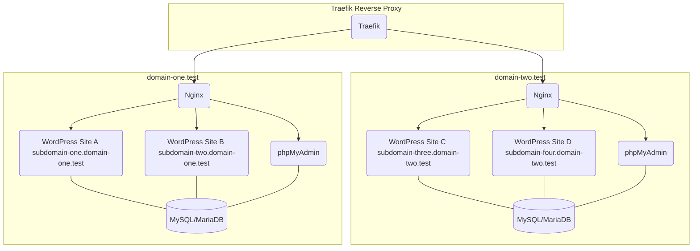

# Multi-Stack LEMP Setup for Wordpress (Docker-Based + Shell Automation)

This project automates the creation of multiple independent **LEMP stacks** in **Docker**, as well as automating the creation of Wordpress containers. Each LEMP Stack creates its own Virtual host local development domain any Wordpress container created underneath will be added as a subdomain within a LEMP stack's virtual host domain and SSL Certificate.

## What is it?

 CLI Utility Tool script that launches a menu system with options to manage multiple Docker LEMP stacks and their respective WordPress containers. Terminal prompts to choose tasks within each. Creating LEMP stacks, Creating Wordpress containers, and management of each.

## TL;DR

Open the project directory in a terminal and run
```
sh start.sh
```
This will attempt to install any package managers or packages for your specifc  operating system that will automate the process before showing you the menu system.

#### Welcome Menu (example)
```
#     MULTISTACK OPTIONS
#     __________________
#
#     > 1. Create New LEMP Stack
#     > 2. Manage domain-one
#     > 3. Manage domain-two
#     > 4. Help
#     > 5. Quit
#
#     >>> What would you like to do?
#     >>>
```

#### Manage LEMP Stack Menu (example)
```
#     DOMAIN-ONE OPTIONS
#     _______________________
#
#     > 1. Create New WordPress Container
#     > 2. Start domain-one
#     > 3. Restart domain-one
#     > 4. Stop domain-one
#     > 5. Open https://domain-one.test in Browser
#     > 6. Open https://phpmyadmin.domain-one.test in Browser
#     > 7. Database: Backup Dump
#     > 8. Database: Recover Tables
#     > 9. Remove domain-one
#     > 10. Help
#     > 11. Back to Main Menu
#     > 12. Quit
#
#     >>> Select an option for domain-one:
#     >>>
```
>⚠️  **POSIX-compatible NOTE**
>

>Only tested on macOS’s zsh/bash however written to be POSIX-compatible. The project contains code blocks where homebrew is used as the package manager for package download/install/and checks as well as including conditionals to check for os specific, e.g. Chocolatey or Scoop on Windows, however the efficacy of these code blocks were not tested. Submit pull requests if you fix anything for other operating systems.

## Requirements
- Terminal of choice – e.g. [iTerm2](https://iterm2.com/) (macOS) or your preferred terminal emulator.
- Package manager – [Homebrew](https://docs.brew.sh/Installation) (macOS/Linux), [Chocolatey](https://chocolatey.org/install) or [Scoop](https://scoop.sh/) (Windows) to install other tools
- [Docker Desktop / Docker Engine](https://www.docker.com/) – Docker to run containers
- mkcert – mkcert for generating local SSL certificates (https://github.com/FiloSottile/mkcert)

## Architecture Overview

Each **LEMP stack** runs in Docker and includes:
- **PHP** Empty 'html' directory to run any php code you want.
- **Nginx** (unique server domain and configuration)
- **MySQL or MariaDB** database served on the network allowing Wordpress containers to share the database for centralized files
- **phpMyAdmin** Management of all wordpress database tables created underneath this LEMP stack through root user. Each Wordpress connects via unique credentials.
- **SSL certificates** for domain and all subdomains

Each **WordPress container** runs in Docker and is connected to a specific LEMP stack's database on the same network.
- Has its own **subdomain** and inherits **SSL certificate** from its LEMP stack's domain.
- Each Wordpress container shares the **parent LEMP stack's database** but connects to it's unique database via its own user and pass provided by your input during the terminal

###### NOTE: All information below this line is a work in progress. There are alot of moving parts and documentation below was
---

## How the Multistack Setup Works

### Traefik Container

- Runs traefik to route browsers to each LEMP Stack virtual host domain and subdomains.
- Building LEMP Stacks creates a new virtual host config file in traefik/dynamic. (ie https://<LEMP_DOMAIN>, https://phpmyadmin.<LEMP_DOMAIN>)
- Building Wordpress Containers creates a new virtual host subdomain for parent LEMP's domain config file. (ie https://<WORDPRESS_SUBDOMAIN>.<LEMP_DOMAIN>)

### LEMP Compose Stack(s)

- Creates new virutal host domains, Nginx, MySQL, PHP, and phpMyAdmin
- Unique PHP root directory and independant PHP version for files hosted from the $STACK_NAME/ directory.
- LEMP's MySQL container contains all databases unique to the LEMP stack and databases created for Wordpress containers under this LEMP STACK.
- LEMP's PHP container version DOES NOT affect LEMP STACK phpMyAdmin NOR WordPress container's PHP version.
- LEMP STACK phpMyAdmin routed under LEMP STACK's main domain, (ie https://phpmyadmin.<LEMP_DOMAIN>)
- LEMP STACK phpMyAdmin container runs its on PHP version inside its own container.
- LEMP STACK phpMyAdmin container connects to the LEMP's MYSQL container hosting databases unique to the LEMP stack.

### LEMP Compose Stack(s) -> WordPress Container(s)

- Creates a new subdomain under LEMP STACK's main domain, and unique traefik config file for this subdomain
- Connects to the LEMP Stack docker network LEMP STACK MYSQL container to create database during set up of this WordPress container.
- Wordpress images contain its own PHP version. (ie wordpress:latest = PHP likely > 8.x.x)
- DOES NOT use the LEMP STACK PHP container.
- Runs independently.

---


### Accomplished Goals for the project
- Forget MAMP/LAMP thats for GRAMPS
- **Automated LEMP stacks** to quickly spin up any version of php, mysql, and wordpress and launch the browser to display phpmyadmin and main LEMP stack domain on completion of script.
- **Isolated Docker networks** to serve various images for different projects
- **Automated Virtual Host and Traefik configuration**:
  - Creates locally signed certificates for virtual host domains and subdomains automatically as well as making changes to your hosts file for you.
- Automated **database backups** per LEMP stack

---

## Key Features

- Fully modular — add or remove LEMP stacks without impacting others
- Centralized **Traefik reverse proxy** for routing and SSL management
- Organized, automated backup strategy (daily + monthly retention)
- Scalable to host multiple WordPress sites per LEMP stack
- Compatible with **Docker Compose** for orchestration

---

## System Diagram



---

## Shell Automation (POSIX sh)

All automation is implemented in **portable POSIX shell** (no Bash-only features) and organized into reusable functions.

### Virtual Hosts with SSL Certificates(example)
View the directory layout below to see where the CLI tool places each *.crt & *.key files:
-  /traefik/certs/*.test.crt
-  /traefik/certs/*.test.key
```
https://domain-one.test
└─ https://suddomain-one.domain-one.test
└─ https://suddomain-two.domain-one.test

https://domain-two.test
└─ https://suddomain-three.domain-two.test
└─ https://suddomain-four.domain-two.test
```

### Directory Layout (example)

```
docker-multistack-lemp
├── _environment.sh
├── functions
├── scripts
├── stacks
│   ├── domain-one (Docker Container)
│   │   └── containers
│   │       ├── suddomain-one (Docker Container)
│	│	 	│	├── docker-compose.yml
│	│	 	│	├── Dockerfile
│   │       │   └─── html
│   │       └── subdomain-two (Docker Container)
│	│	 		├── docker-compose.yml
│	│	 		├── Dockerfile
│   │           └── html
│   └── domain-two (Docker Container)
│    	   	└─── containers
│       	    ├── subdomain-three (Docker Container)
│			 	│	├── docker-compose.yml
│			 	│	├── Dockerfile
│      		    │   └─── html
│       	    └── subdomain-four (Docker Container)
│			 		├── docker-compose.yml
│			 		├── Dockerfile
│       	        └── html
├── start.sh
├── templates
└── traefik
    ├── certs
    │   ├── domain-one.test.crt
    │   ├── domain-one.test.key
    │   ├── domain-two.test.crt
    │   └── domain-two.test.key
    ├── docker-compose.override.yml
    ├── docker-compose.yml
    ├── dynamic
    │   ├── certs.yml
    │   ├── lemp-domain-one.yml
    │   └── lemp-domain-two.yml
    └── traefik.yml

```

